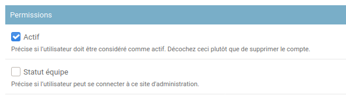

# Lapin Blanc

## Ajouter des salariés

La configuration se faire sur l'interface d'administration, accessible à
http://lapin-blanc.telescoop.fr/configuration/.

Pour ajouter un salarié, aller sur la
[liste des utilisateurs](http://lapin-blanc.telescoop.fr/configuration/auth/user/)
puis cliquer sur le bouton en haut à droite "Ajouter un utilisateur".

Remplir ensuite les informations demandées. Ça devrait être assez simple.
Pour obtenir l'adresse du calendrier, aller dans les paramètres du calendrier Google,
puis trouver la section "Adresse secrète au format ical", c'est ce lien
(caché par défaut) qu'il faut utiliser.

Une fois les informations enregistrées, d'autres informations peuvent être ajoutées,
comme le nom et prénom. Pour n'afficher que le prénom sur l'interface, laisser le nom
vide. La partie "Permissions" peut être utile :

- Pour un ancien employé dont on veut garder l'historique mais dont on ne souhaite
plus qu'il ait accès à l'outil, décocher la case Actif
- La case Statut Équipe donne à l'utilisateur l'accès au site de configuration. Même
avec le Statut Équipe, un utilisateur non administrateur d'une entreprise n'a accès
à rien sur le site de configuration

### Types de salariés

Un salarié peut avoir deux statuts :

- normal, dans ce cas il ne voit que ses informations sur le site de Lapin Blanc
- administrateur d'une entreprise, dans ce cas :
  - il peut ajouter d'autres salariés de cette entreprise
  - depuis l'interface principale il a accès aux informations
    de tous les salariés de cette entreprise
  - il peut gérer les alias de projet

Pour configurer les administrateurs d'une entreprise, se rendre sur la
[configuration des entreprise](http://lapin-blanc.telescoop.fr/configuration/white_rabbit/company/),
l'entreprise concernée, puis ajouter l'utilisateur aux administrateurs de l'entreprise.

## Gérer les alias de projet

Les alias sont une autre manière de nommer les projets. Ils peuvent être utile pour
créer des raccourcis (utiliser SP à la place de Super Projet) ou gérer des erreurs
(configurer Mon Super Projet comme alias de Super Projet si les deux sont utilisés).

Tout nom d'événement est considéré comme un projet en soit, s'il s'il est défini comme
étant alias d'un autre projet.

La gestion des alias se fait depuis la
[configuration des projets](http://lapin-blanc.telescoop.fr/configuration/white_rabbit/project/).

En cliquant sur un projet, on peut définir les alias de ce projet. Pour transformer un
projet déjà détecté en alias de projet, revenir à [configuration des projets](http://lapin-blanc.telescoop.fr/configuration/white_rabbit/project/), sélectionner le projet concerner, puis sélectionner Transformer en alias
d'un autre projet dans la liste des actions et cliquer sur Envoyer :

Une autre page s'ouvre, il suffit alors de choisir le projet cible.

## Conventions de de nommage événements

- Lapin Blanc ignore ce qui commence par `!`
- Lapin Blanc ignore ce qu'il y a après le tiret ce qui permet d'ajouter des informations
non prises en compte, ex `nom du projet - détails`
- la casse (majuscule/miniscule) est ignorée, tout est converti en casse de titre
(Majuscule Au Début Des Mots), sauf lorsqu'un nom est entièrement en majuscule
(par exemple ANCT), auquel cas il est gardé tel quel

## Autres informations utiles

- Lapin Blanc ne garde aucune mémoire de l'historique (hormis les noms de projet et alias).
À chaque fois que la page d'accueil est chargé, Lapin Blanc télécharge l'historique de tous
les utilisateurs à afficher et fait les caculs appropriés.
- Lapin Blanc a un cache de une minute. Donc si vous visualisez la page d'accueil, modifiez
votre agenda et rechargez moins d'une minute plus tard, vous verrez une page qui peut ne plus
être à jour. Mais après une minute de patience au plus, les changements opérés dans l'agenda
seront bien pris en compte.

## Bogues connus

- Lapin Blanc ne prend pas en compte les événements récurrents
- il faut ajouter à la main les jours fériés
- Lapin Blanc ne sait pas ignorer les événements avec invitation initiées par qqn d'autre
